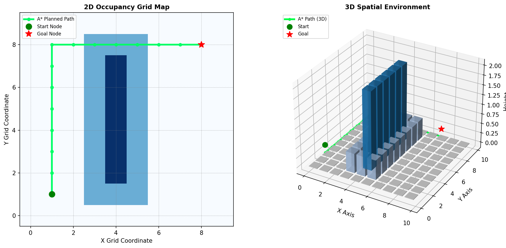

# DecodeLabs Project 3: AMR Navigation Simulator

This repository contains the complete implementation for **Task 3: Autonomous Mobile Robot (AMR) Navigation** under the DecodeLabs Internship Program.

## 🌟 Key Features
- **State Estimation (EKF)**: Extended Kalman Filter fusing Odometry and IMU feeds to generate continuous states.
- **Global Pathfinding (A*)**: Custom implementation using **Manhattan Distance Heuristic** on an Occupancy Grid with safety inflation layers.
- **Local Avoidance Controller**: Reflexive safety layer using a **Hyperbolic Tangent ($\tanh$)** deceleration function for dynamic obstacle avoidance and emergency braking.
- **Dual Spatial Visualization**: Integrated 2D Occupancy Grid and 3D Spatial Environment rendering.

## 📊 Navigation Preview


## 🚀 How to Run
```bash
python amr_navigation.py
